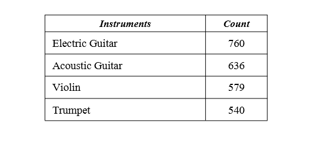

# Instrument-Classification-of-IRMAS-Dataset

The DataSet -   
IRMAS is intended to be used for training and testing methods for the automatic recognition of predominant instruments in musical audio. The instruments considered are: acoustic guitar, electric guitar, trumpet, and violin. This dataset is derived from the one compiled by Ferdinand Fuhrmann in his PhD thesis, with the difference that we provide audio data in stereo format, the annotations in the testing dataset are limited to specific pitched instruments, and there is a different amount and length of excerpts.

The Features Extracted -
The features were extracted using the python library “LibROSA”. LibROSA is a python package for music and audio analysis. It provides the building blocks necessary to create music information retrieval systems. This library was used to extract the following features from the dataset:  

1.Beat Frames   
2.Spectral Centroid   
3.Bandwidth   
4.Rolloff   
5.Zero Crossing Rate   
6.Root Mean Square Energy   
7.Tempo    
8.MFCC  
   
The above 8 features were further distributed to their mean, sum, variance and standard deviation. Also, we have 20 coefficients in MFCC so all of them were treated as different attributes causing the number of features to bea total of 98.   

Feature Selection -      
L1 based feature selection is a simple baseline approach to feature selection. It removes all features whose variance doesn’t meet some threshold. By default, it removes all zerovariance features, i.e. features that have the same value in all samples. This approach was used to reduce the dimension on the IRMAS dataset. Fortunately, L1 based feature selection gave better results compared to the principal component analysis (PCA). The L1 approach reduced the total 98 feature set to only 63 features. It helped to remove 35 features and reduce our feature vector size drastically. The difference was huge and therefore the new generated matrix was then further used for the remaining process.    

Methodology -   
The methodology used to tackle the problem of instrument classification was that we decided to run five different classifiers with three different approaches of applying the classification algorithm and then comparing them with each other to finally find the best model and approach for instrument classification.The three approaches are given below:   
1.K- Fold Cross Validation  
2.Leave one out - Cross Validation  
3.Hold out Approach  

Algorithms tested -  
1.Bagging   
2.Random Forest   
3.Decision Tree Classifier  
4.Naive Bayes   
5.K nearest neighbours  

Results -  

